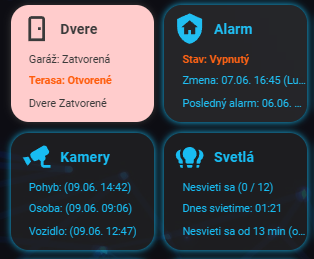
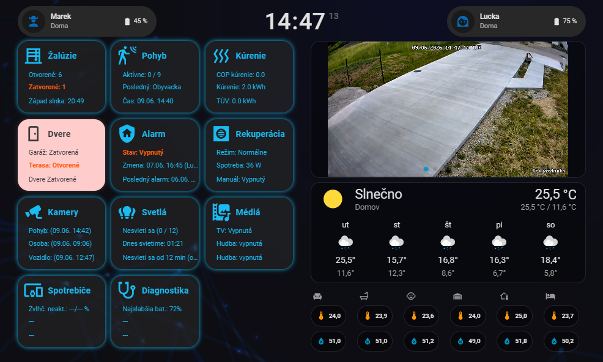
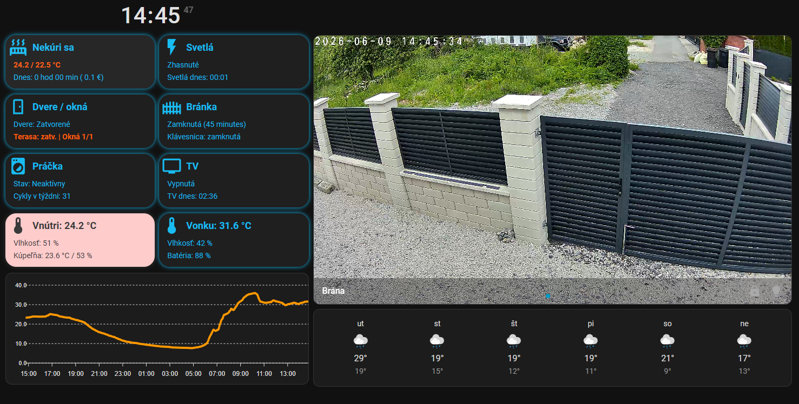
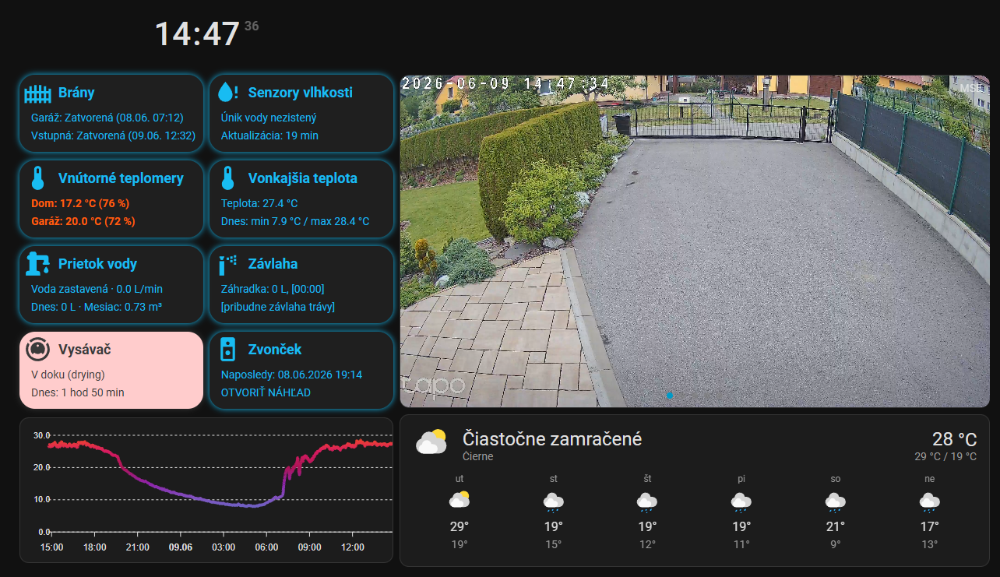

# Tablet Info Card

A compact Home Assistant Lovelace card for status/navigation tiles with one icon, one title, and up to three detail rows.

The card is intentionally a **visual component**. The preferred pattern is to keep dashboard logic in Home Assistant template sensors and let the card render a stable attribute contract.

The source is written in Lit, TypeScript, and Vite. Home Assistant loads it as a standard Lovelace custom element, and HACS installs the compiled `dist/tablet-info-card.js` bundle.

## Screenshots









## Why this card exists

Home Assistant dashboards often become hard to maintain when every card instance repeats the same input entities, Jinja snippets, warning rules, labels, and navigation paths.

This card is built around a reusable component pattern:

- Define the logic once in Home Assistant, for example in `/homeassistant/templates/ui_elements.yaml`.
- Expose that logic as a template sensor with UI-focused attributes.
- Reuse the same visual card anywhere by passing only one entity.

```yaml
type: custom:tablet-info-card
source: template_entity
entity: sensor.ui_element_blinds
```

That keeps the Lovelace card clean and makes each template sensor act like a small UI view-model. If you want to move the same tile to another dashboard, you do not need to copy Jinja code or repeat the same row definitions.

The card still supports direct YAML configuration as a fallback for users who do not want this template sensor pattern.

## Recommended Home Assistant structure

Create a template file like this:

```text
/homeassistant/templates/ui_elements.yaml
```

Include it from `configuration.yaml`:

```yaml
template: !include_dir_merge_list templates/
```

Then define one or more template sensors in `ui_elements.yaml`. Each sensor can describe one reusable UI element.

See [examples/ui-elements-template.yaml](examples/ui-elements-template.yaml) for a complete example.

## Template sensor contract

The preferred input is a single entity with these attributes:

| Attribute | Required | Description |
| --- | --- | --- |
| `ui_element_type` | For UI picker | Set to `tablet_info_card` so the visual editor and card suggestions can list only compatible template entities. |
| `name` | No | Title shown in the card. Falls back to the entity friendly name. |
| `icon` | No | Main Material Design icon. Falls back to `mdi:flash`. |
| `navigation_path` | No | Dashboard path used when the main card is tapped. |
| `is_warn` | No | Switches the main card into warning colors. |
| `row_1_text` | No | Text for the first detail row. |
| `row_1_entity` | No | Entity opened with `more-info` when the first row is tapped. |
| `row_1_warn` | No | Highlights the first row. |
| `row_2_text` | No | Text for the second detail row. |
| `row_2_entity` | No | Entity opened with `more-info` when the second row is tapped. |
| `row_2_warn` | No | Highlights the second row. |
| `row_3_text` | No | Text for the third detail row. |
| `row_3_entity` | No | Entity opened with `more-info` when the third row is tapped. |
| `row_3_warn` | No | Highlights the third row. |

You can define only the rows you need. Missing rows, for example `row_3_text`, are simply not rendered.

## Template sensor example

```yaml
- sensor:
    - name: "Blinds [UI]"
      unique_id: ui_element_blinds
      state: >
        
        
        {{ 'Open' if open_count > 0 else 'Closed' }}
      attributes:
        ui_element_type: tablet_info_card
        name: "Blinds"
        icon: "mdi:blinds-horizontal"
        navigation_path: "/lovelace/blinds"
        is_warn: >
          
          
          {{ open_count > 0 and is_state('sun.sun', 'below_horizon') }}

        row_1_entity: sensor.ui_element_blinds
        row_1_text: >
          
          
          Open: {{ open_count }}
        row_1_warn: >
          
          
          {{ open_count > 0 and is_state('sun.sun', 'below_horizon') }}

        row_2_entity: sun.sun
        row_2_text: >
          
          Sunset: {{ as_timestamp(next_setting) | timestamp_custom('%H:%M', true) if next_setting else '-' }}
        row_2_warn: false
```

Dashboard usage stays small:

```yaml
type: custom:tablet-info-card
source: template_entity
entity: sensor.ui_element_blinds
```

After creating a template sensor with `unique_id`, Home Assistant may generate an entity ID from the sensor name. Rename or confirm it in Home Assistant if you want a stable entity ID such as `sensor.ui_element_blinds`.

The visual editor and Home Assistant card suggestions use the `ui_element_type: tablet_info_card` marker to list compatible template entities. Template sensors without the marker still work when referenced manually in YAML, but they will not appear in those filtered UI flows.

## Installation with HACS as a custom repository

1. In Home Assistant, open HACS.
2. Open the three-dot menu and choose **Custom repositories**.
3. Add `https://github.com/petosiso/tablet-info-card`.
4. Select category **Dashboard**.
5. Download the repository.

If Home Assistant does not add the dashboard resource automatically, add it manually:

```yaml
url: /hacsfiles/tablet-info-card/tablet-info-card.js
type: module
```

## Fallback config-driven usage

You can also configure everything directly in Lovelace without template sensors:

```yaml
type: custom:tablet-info-card
source: manual
entity: sun.sun
name: Sun overview
icon: mdi:white-balance-sunny
navigation_path: /lovelace/default_view
warn:
  entity: sun.sun
  state: below_horizon
height: 130
title_font_size: 16
row_font_size: 12
rows:
  - entity: sun.sun
    name: State
    warn:
      entity: sun.sun
      state: below_horizon
  - entity: sun.sun
    attribute: next_rising
    name: Next rising
  - entity: sun.sun
    attribute: next_setting
    name: Next setting
```

Rows support static text or entity-derived text. If a row has `entity` but no `text`, the card renders the entity friendly name and state.

For simple fallback use cases, `warn` can also be driven by an entity state:

```yaml
warn:
  entity: binary_sensor.garage_door
  state: "on"
```

Multiple states are supported:

```yaml
warn:
  entity: cover.bedroom_blinds
  state:
    - open
    - opening
```

Use `not_state` when the warning should be active for every state except the listed one:

```yaml
warn:
  entity: sensor.tablet_battery_health
  not_state: normal
```

The warning object supports these fields:

| Field | Type | Required | Description |
| --- | --- | --- | --- |
| `entity` | string | Yes | Entity whose state is checked. |
| `state` | string or list | No | Warning is active when the entity state matches. |
| `not_state` | string or list | No | Warning is active when the entity state does not match. |

The card intentionally does not evaluate Jinja in Lovelace YAML. For complex conditions, calculations, formatting, or comparisons, create a Home Assistant template sensor and expose the final text/warning attributes to the card.

## Card options

| Option | Type | Default | Description |
| --- | --- | --- | --- |
| `source` | `template_entity` or `manual` | `template_entity` | Selects whether rows and default values come from template entity attributes or direct card config. |
| `entity` | string | optional | Main entity used for title, icon, warning state, navigation path, and fallback row attributes. |
| `name` | string | entity/template attribute | Main title override. |
| `icon` | string | template attribute or `mdi:flash` | Main Material Design icon override. |
| `navigation_path` | string | template attribute | Path used for the default card tap action. |
| `tap_action` | object | navigate or more-info | Home Assistant tap action for the main card. |
| `warn` | boolean or object | template `is_warn` or `false` | Switches the card to warning colors, either statically or by matching another entity state. |
| `rows` | list | template row attributes or empty | Up to three detail rows. |
| `background_ok` | string | `rgba(46, 46, 46, 0.5)` | Normal card background. |
| `background_nok` | string | `#ffcccc` | Warning card background. |
| `text_ok` | string | `#18bcf2` | Normal text/icon color. |
| `text_nok` | string | `#3a3a3a` | Warning text/icon color. |
| `text_highlight` | string | `#ff5d0c` | Warning row highlight color. |
| `height` | string or number | `130px` | Card height. Unitless values from the UI editor are treated as pixels. |
| `border_radius` | string | `20px` | Card border radius. |
| `icon_size` | string | `37px` | Icon size. |
| `icon_col_width` | string | `37px` | Icon column width. |
| `row_indent` | string | `10px` | Left padding for detail rows. |
| `title_font_size` | string or number | `16px` | Font size for the card title. Unitless values from the UI editor are treated as pixels. |
| `row_font_size` | string or number | `12px` | Font size for detail rows. Unitless values from the UI editor are treated as pixels. |

## Fallback row options

These options apply only when you define `rows` directly in Lovelace:

| Option | Type | Default | Description |
| --- | --- | --- | --- |
| `text` | string | entity-derived | Text shown in the row. |
| `entity` | string | optional | Entity used for default `more-info` tap action and derived row text. |
| `name` | string | entity friendly name | Label used when text is derived from an entity. |
| `attribute` | string | optional | Entity attribute to display instead of state. |
| `unit` | string | entity unit | Unit appended to derived state text. |
| `show_name` | boolean | `true` | Set to `false` to show only the derived value. |
| `warn` | boolean or object | `false` | Highlights the row, either statically or by matching another entity state. |
| `inherit_warn` | boolean | `false` | Lets the row inherit the main card warning state. |
| `tap_action` | object | `more-info` | Home Assistant tap action for the row. |

## Development

The card is implemented as small Lit Web Components:

```text
src/
  main.ts                          # HACS card picker registration and bundle entry
  tablet-info-card.ts              # Home Assistant custom card lifecycle
  card-source.ts                   # data-source and template-entity helpers
  components/
    tablet-info-card-editor.ts     # visual editor coordinator used by Home Assistant
    tablet-info-card-body.ts       # visual card shell and card tap action
    tablet-info-card-header.ts     # icon and title
    tablet-info-card-rows.ts       # row list
    tablet-info-card-row.ts        # one detail row and row tap action
    editor/                        # focused source, entity, manual, and layout editor controls
  viewModel.ts                     # config/entity attributes -> render model
  styles.ts                        # CSS variable helpers
  types.ts                         # HA and card config types
```

Install dependencies and build:

```bash
npm install
npm run check
```

Run a local Vite dev server for testing from Home Assistant:

```bash
npm run dev -- --port 5173
```

Then add a temporary Home Assistant dashboard resource:

```yaml
url: http://YOUR_DEV_MACHINE_IP:5173/src/main.ts
type: module
```

Disable the HACS resource for the same card while using the dev server, because the browser can register `custom:tablet-info-card` only once.

`npm run build` writes the HACS-ready bundle to:

```text
dist/tablet-info-card.js
```

Lit is bundled into that file, so Home Assistant users do not install any frontend dependency separately.

## Release checklist

1. Update `version` in `package.json`.
2. Update `CARD_VERSION` in `src/constants.ts`.
3. Run `npm run check`.
4. Commit the source files and generated `dist/tablet-info-card.js`.
5. Create a GitHub release, for example `v0.4.0`.
6. In HACS, redownload the custom repository.
